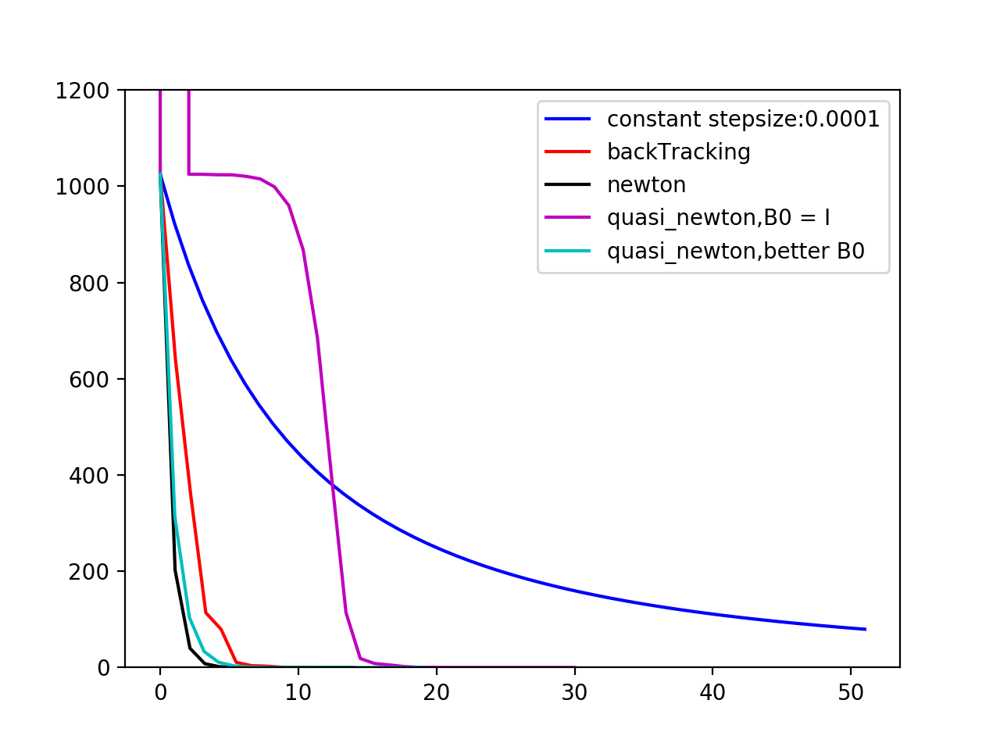

# Optimization

-[LineSearch](LineSearch/)

f(x) = (x1 - 4)^4 + (x2 -3)^2 + 4(x3 +5)^4

In this small program,try to implement the algorithms about line search to find out the best stepsize for the gradient descend and also make a comparison.

Importantly,when using the secant method(quasi-newton method) in high-dimension,we will use [BFGS](https://en.wikipedia.org/wiki/Broyden–Fletcher–Goldfarb–Shanno_algorithm)(or others) to approximate the second derivative(Hessian Matrix),and the initialization of the B0 would be important,sometimes,if we don't know how to initize the B0 at the beginning,we will initilize the B0 as Indentity Matrix,but it would cause the first iteration lead to a unpleasant function value,just like the figure show below.

To sum up, it is no doubt that newton method is the most effective way,however,computing the second derivative is so hard sometimes,we will turn to quasi-newton or backtracking,and backtracking is rather easy to implement.
 
